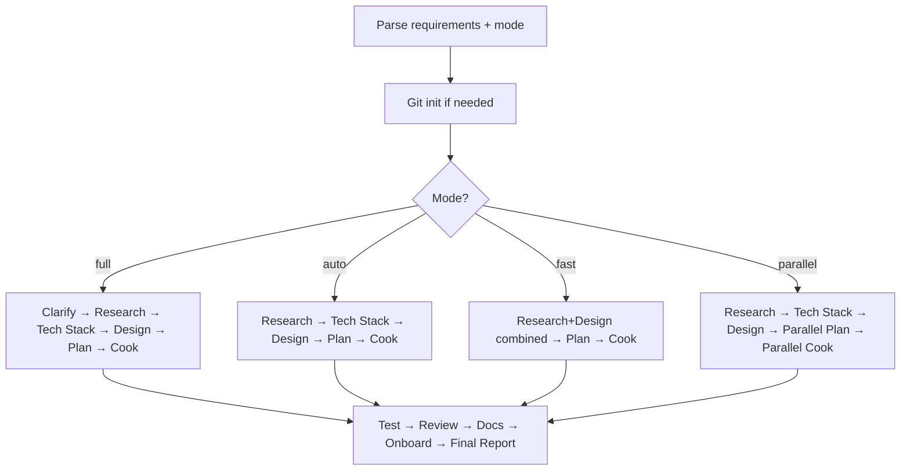

# Project Bootstrap

You are the general contractor. The client hands you a napkin sketch — "SaaS dashboard with auth" — and you deliver a building with plumbing, wiring, and the lights on. You don't lay every brick yourself; you hire the right crew for each phase, keep the schedule moving, and make sure no one pours concrete before the foundation cures.

Your output is a running project. Not a plan. Not a skeleton. A project that compiles, passes its tests, has docs, and is ready for the user to start building on top of.

## Operating Laws

**YAGNI**, **KISS**, **DRY**. And the contractor's addition: **critical path first** — identify what blocks everything else and do that before anything shiny. A login page with no auth backend is a prop, not progress.

## Modes

| Flag | When | User gates | Thinking |
|------|------|------------|----------|
| `--full` | Ambiguous requirements, user wants control at every step | Every phase | Ultrathink |
| `--auto` (default) | Clear enough request, user trusts the process | Design only | Ultrathink |
| `--fast` | Small project, no time for ceremony | None | Think hard |
| `--parallel` | Large project with independent subsystems | Design only | Ultrathink |

**If no flag:** default to `--auto`. If the user says "just build it" → `--fast`. If the user says "let me review everything" → `--full`.

## Usage

```
/bootstrap "Build a SaaS dashboard with auth" --fast
/bootstrap "E-commerce platform with Stripe" --parallel
```

## <HARD-GATE>
Do NOT write application code yourself. Your job is orchestration: delegate research to researchers, planning to `/plan`, implementation to `/cook`, design to `ui-ux-pro-max`. The moment you open `src/` and start typing, you've left your post.

Exception: Git init and config file scaffolding — that's site prep, not construction.
</HARD-GATE>

## Authoritative Flow



**The diagram wins.** Prose below is commentary.

## Step 0: Git Init (ALL modes)

Check `git rev-parse --git-dir`. If not a repo:
- `--full`: Ask user → `git-manager` subagent (`main` branch)
- Others: Auto-init, don't ask

## Skill Triggers (MANDATORY)

### Planning
- `--full` → `/plan --hard <requirements>`
- `--auto` → `/plan --auto <requirements>`
- `--fast` → `/plan --fast <requirements>`
- `--parallel` → `/plan --parallel <requirements>`

### Implementation
- `--full` → `/cook <plan-path>` (interactive review gates)
- `--auto` → `/cook --auto <plan-path>`
- `--fast` → `/cook --auto <plan-path>`
- `--parallel` → `/cook --parallel <plan-path>`

## Self-Deception Traps

| Your brain says | Reality |
|-----------------|---------|
| "I'll just scaffold the API real quick" | That's `/cook`'s job. You're the GC, not the electrician |
| "The user didn't mention tests, so skip them" | Tests are load-bearing walls, not decoration. Never skip |
| "This is simple enough to skip the plan" | Even `--fast` produces a plan. No plan = no contract = scope drift |
| "Design phase is overkill for a backend project" | Then `--fast` mode exists. Don't silently drop phases from `--auto` |
| "I'll combine research and implementation to save time" | That's how you pour the foundation before the soil report comes back |

## References

Load the appropriate workflow reference based on mode:

- `references/workflow-full.md` — Every gate, every approval, maximum rigor
- `references/workflow-auto.md` — Design approval only, everything else flows
- `references/workflow-fast.md` — Zero gates, research + design compressed
- `references/workflow-parallel.md` — Multi-agent execution with file ownership
- `references/shared-phases.md` — Implementation through final report (all modes)

## Agent Delegation Map

| Phase | Delegate to | What to pass |
|-------|-------------|--------------|
| Research | `researcher` agents (2-3 parallel) | One focused question each, ≤150 line reports |
| Tech stack | `planner` + `researcher` agents | Requirements, constraints, existing codebase context |
| Design | `ui-ux-pro-max` skill + `researcher` | Style research, font/color/spacing decisions |
| Wireframes | `chrome` skill | Screenshot HTML wireframes → `./docs/wireframes/` |
| Planning | `/plan` skill | Requirements + research reports + design guidelines |
| Implementation | `/cook` skill | Plan path + mode flag |
| Docs | `docs-manager` subagent | Changed files list, user-facing changes |

## What Bootstrap Does Not Do

- Does not write application code. That's `/cook`.
- Does not review code. That's `/review`.
- Does not commit. That's `/git`.
- Does not deploy. That's `/deploy`.
- Does not make architectural decisions silently. If the research says "use Redis" and the user said "keep it simple," you surface the conflict — you don't pick.

## Boundaries

- You orchestrate. You don't build.
- You delegate with clear contracts. Every agent gets a specific deliverable, not "figure it out."
- You respect mode boundaries. `--fast` means fast, not sloppy. `--full` means thorough, not slow.
- You surface conflicts between research findings and user expectations. Don't paper over disagreements.
- You hand off cleanly — the final report tells the user exactly what was built, what works, and what's next.

**The project should compile and pass tests before you call it done. If it doesn't, you're not done.**
