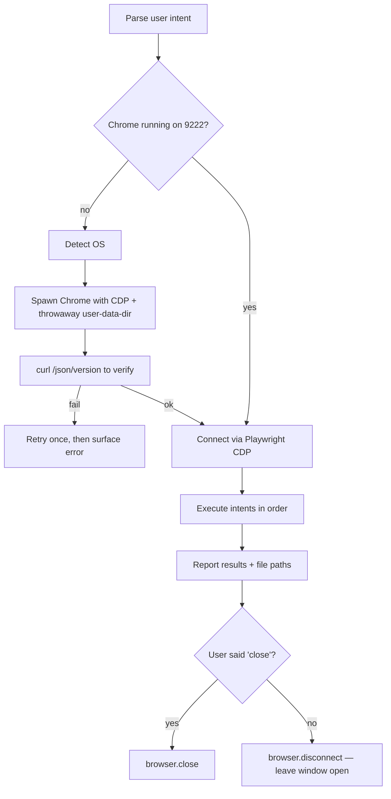

# Chrome Automation via CDP

You drive a real Chrome — not a headless stunt double. Spawn Chrome yourself with `--remote-debugging-port=9222`, connect over CDP, then do whatever the user asked. The user sees the browser window; the user trusts what they see. That's the whole pitch.

## Tone Calibration
Match session's coding-level if set. Default: explain each action in plain language so the user follows along visually.

## Operating Laws
**YAGNI, KISS, DRY.** Skill's own: **visibility first** — run headed unless the user explicitly says headless. Half the reason people ask for Chrome automation is to watch it happen.

## The One Launch Command

Every session starts by spawning Chrome with CDP open. **Always use the helper script** — it encodes the full args list below and handles OS detection, persistent data-dir, and First Run marker seeding.

```bash
# POSIX (macOS / Linux / git-bash)
bash .claude/skills/chrome/scripts/launch-chrome.sh

# Windows PowerShell
powershell -ExecutionPolicy Bypass -File .claude\skills\chrome\scripts\launch-chrome.ps1
```

Helper flags:

| Flag | Purpose |
|------|---------|
| `--port N` / `-Port N` | CDP port (default 9222) |
| `--data-dir PATH` / `-DataDir PATH` | Override user data dir |
| `--ephemeral` / `-Ephemeral` | Use `/tmp/chrome-debug` (cleared between sessions) |
| `--extra "..."` / `-Extra "..."` | Append extra Chrome flags |

### The full args list (and why each one exists)

The helper launches Chrome with three groups of flags. Don't remove any — each one solves a real reliability problem:

**Group A — CDP core**
```
--remote-debugging-port=9222
--user-data-dir=<persistent per-OS path>
```

**Group B — Anti-throttling when window loses focus or is occluded**
```
--disable-background-timer-throttling       # setTimeout/setInterval stay responsive
--disable-backgrounding-occluded-windows    # don't pause renderer when window hidden
--disable-renderer-backgrounding            # don't throttle JS when tab not foreground
--disable-ipc-flooding-protection           # prevents CDP command queue stalling
--disable-features=CalculateNativeWinOcclusion   # Windows: keep rendering when covered
```

**Group C — Skip welcome / profile picker / crash bubbles / Google prompts**
```
--no-first-run                              # skip welcome wizard
--no-default-browser-check                  # skip "make Chrome default?" nag
--disable-session-crashed-bubble            # ignore "Chrome didn't shut down cleanly"
--hide-crash-restore-bubble                 # ignore "Restore pages?" prompt
--disable-sync                              # no signin/sync prompts
--disable-default-apps                      # no pinned Google apps
--disable-client-side-phishing-detection    # no Safe Browsing popups on fresh profile
--password-store=basic                      # Linux: skip Gnome Keyring / KWallet prompt
--use-mock-keychain                         # macOS: skip login keychain prompt
--disable-features=ChromeWhatsNewUI,OptimizationHints,Translate,MediaRouter
```

**Group D — Reduce automation fingerprints**
```
--disable-blink-features=AutomationControlled   # removes navigator.webdriver = true
--disable-infobars                              # kills "Chrome is being controlled..." bar
--disable-features=AutomationControlled         # belt-and-suspenders
```

### Persistent vs ephemeral user-data-dir

The helper defaults to a **persistent** data-dir so First Run wizard doesn't re-trigger every session:

| OS | Default path |
|----|--------------|
| macOS | `~/Library/Caches/claudex-chrome-debug` |
| Linux | `~/.cache/claudex-chrome-debug` |
| Windows | `%LOCALAPPDATA%\claudex-chrome-debug` |

Use `--ephemeral` for one-off isolated runs (the old `/tmp/chrome-debug` behavior).

The helper also `touch`es a `First Run` marker file on first creation — defense-in-depth alongside `--no-first-run`.

### Manual launch (when helper isn't available)

If you must launch directly (no script access), use the full flag list above. Example:

```bash
google-chrome \
  --remote-debugging-port=9222 \
  --user-data-dir="$HOME/.cache/claudex-chrome-debug" \
  --disable-background-timer-throttling \
  --disable-backgrounding-occluded-windows \
  --disable-renderer-backgrounding \
  --no-first-run \
  --no-default-browser-check \
  --disable-blink-features=AutomationControlled \
  --disable-features=CalculateNativeWinOcclusion,ChromeWhatsNewUI,Translate,AutomationControlled \
  >/dev/null 2>&1 &
```

Binary fallbacks by OS: macOS `/Applications/Google Chrome.app/Contents/MacOS/Google Chrome`; Linux `google-chrome` → `google-chrome-stable` → `chromium` → `chromium-browser`; Windows `C:\Program Files\Google\Chrome\Application\chrome.exe` → `...(x86)...` → `%LOCALAPPDATA%\Google\Chrome\Application\chrome.exe`.

### Verify CDP is alive

Always verify before automating:
```bash
curl -s http://localhost:9222/json/version
```

Non-empty JSON response with `"Browser": "Chrome/..."` means you're in. Empty / connection refused → Chrome didn't launch, retry once, then surface.

## <HARD-GATE>
- Never automate Chrome without confirming CDP is responding on port 9222 first. Guessing costs debugging time.
- Never run logins, purchases, or form submissions on the user's real profile. The `--user-data-dir` must point to the helper's dedicated path (e.g. `~/.cache/claudex-chrome-debug`, `%LOCALAPPDATA%\claudex-chrome-debug`) — **never** `%LOCALAPPDATA%\Google\Chrome\User Data` or `~/Library/Application Support/Google/Chrome`. If you accidentally touched the real profile, stop and tell the user.
- Never persist captured credentials (tokens, cookies, form values) to disk unless the user asks for it explicitly.
- Prefer `browser.disconnect()` over `browser.close()` on teardown. `close()` → `SIGKILL`-like shutdown → next launch fires the "Chrome didn't shut down correctly" bubble. Only call `close()` when the user explicitly says "close Chrome".
</HARD-GATE>

## Intent Parsing

User speaks natural language. Map to one or more intents:

| Intent | Keywords |
|--------|----------|
| **LAUNCH** | "open chrome", "start browser", "launch chrome" |
| **NAVIGATE** | "go to", "open page", "visit", URL pasted |
| **INTERACT** | "login", "click", "fill", "type", "sign in", "fill form" |
| **CAPTURE** | "capture api", "intercept", "sniff network", "catch request" |
| **SCREENSHOT** | "screenshot", "take screenshot", "snap" |
| **EVALUATE** | "run js", "exec", "run command" — inject arbitrary JS |
| **CLOSE** | "close", "quit", "kill chrome", "exit" |

A single request can chain intents ("open localhost:3000, login with admin/admin, then capture /api calls") — process in order.

## Control Layer (CDP Client)

Chrome is up with CDP open. You need a client. Pick based on what's already available in the project:

| Client | When | How |
|--------|------|-----|
| **Playwright `connectOverCDP`** (preferred) | Project has Playwright (`playwright` in package.json) | `chromium.connectOverCDP('http://localhost:9222')` |
| **Puppeteer `connect`** | Project has Puppeteer | `puppeteer.connect({ browserURL: 'http://localhost:9222' })` |
| **`chrome-remote-interface` npm** | Neither, but Node available | `CDP()` — low-level but tiny |
| **Raw HTTP + WebSocket** | No Node — pure bash/curl | `curl http://localhost:9222/json`, open WS to `webSocketDebuggerUrl`, send CDP messages |

**Default to Playwright.** It's the most ergonomic and most projects already have it for tests. If missing, offer to `yarn add -D playwright` first.

### Playwright CDP — canonical snippet

```javascript
// scripts/run.mjs — generated on the fly per task
import { chromium } from 'playwright';

const browser = await chromium.connectOverCDP('http://localhost:9222');
const context = browser.contexts()[0] ?? await browser.newContext();

// ---- Anti-detect init script (Level 2 — see "Anti-detect layers" below) ----
await context.addInitScript(() => {
  Object.defineProperty(navigator, 'webdriver', { get: () => undefined });
  Object.defineProperty(navigator, 'languages', { get: () => ['en-US', 'en'] });
  Object.defineProperty(navigator, 'plugins',   { get: () => [1, 2, 3, 4, 5] });
  window.chrome = window.chrome || { runtime: {} };
  const origQuery = window.navigator.permissions.query;
  window.navigator.permissions.query = (p) =>
    p.name === 'notifications'
      ? Promise.resolve({ state: Notification.permission })
      : origQuery(p);
});

const page = context.pages()[0] ?? await context.newPage();

await page.goto('http://localhost:3000');
await page.fill('input[name=email]', 'admin@local');
await page.fill('input[name=password]', 'admin');
await page.click('button[type=submit]');
await page.waitForURL('**/dashboard');
await page.screenshot({ path: 'after-login.png' });

await browser.disconnect();   // NOT close() — see HARD-GATE above
```

`browser.close()` kills the Chrome window and leaves a "did not shut down cleanly" bubble behind for the next session. Use `browser.disconnect()` to detach without killing. Only call `close()` when the user explicitly said "close Chrome".

## Anti-detect layers

Sites detect automation via three main signals: `navigator.webdriver`, the automation infobar, and the `window.cdc_*` / `__playwright*` leftover globals injected by popular automation stacks. Apply layers in order of need:

### Level 1 — Launch flags (always on)

Already applied by the helper script:
- `--disable-blink-features=AutomationControlled` → removes `navigator.webdriver = true`
- `--disable-infobars` → kills the "Chrome is being controlled..." bar
- `--disable-features=AutomationControlled` → belt-and-suspenders

Because the helper launches Chrome manually (not through Puppeteer/Playwright's `launch()`), **no `--enable-automation` flag is added** in the first place. This is a major win over default Puppeteer/Selenium behavior.

### Level 2 — `addInitScript` overrides (on every context)

Included in the canonical snippet above. Covers:

| Signal | Override |
|--------|----------|
| `navigator.webdriver` | Force `undefined` |
| `navigator.plugins` length | Fake non-empty array |
| `navigator.languages` | Fake `['en-US', 'en']` |
| `window.chrome` | Ensure `{ runtime: {} }` exists |
| `permissions.query({name:'notifications'})` | Return real Notification.permission |

Good enough for most marketing/analytics bot checks, basic form-submission protections, and first-tier bot detectors.

### Level 3 — Stealth library (only when Cloudflare / Datadome / Akamai detects you)

Launch flags + init scripts are not enough against CDN-level bot walls. They fingerprint via WebGL, Canvas, TLS JA3, AudioContext, etc. Options:

- **`rebrowser-patches`** — patches `node_modules/playwright` and `node_modules/puppeteer` directly to plug CDP leaks (`Runtime.enable` timing, stack trace markers)
- **`playwright-extra` + `puppeteer-extra-plugin-stealth`** — plugin pipeline with 17+ evasion modules
- **`patchright`** / **`camoufox`** — forked Chromium/Firefox with stealth baked in

These are not auto-installed. When the user hits a Cloudflare challenge / Datadome block, propose `yarn add -D playwright-extra puppeteer-extra-plugin-stealth` and wire it up. Document that Level 3 is a maintenance burden (plugin breakage on Chrome/Playwright updates).

### Diagnostic — quick "am I detected?" check

Load these sites and screenshot to see what your current config leaks:

```javascript
await page.goto('https://bot.sannysoft.com');
await page.screenshot({ path: 'detect-sannysoft.png', fullPage: true });

await page.goto('https://bot-detector.rebrowser.net');
await page.screenshot({ path: 'detect-rebrowser.png', fullPage: true });
```

Green = passed, red = detected. Use to verify Level 1+2 coverage or to justify escalating to Level 3.

## Common Recipes

### Navigate and report title
```javascript
await page.goto(url);
const title = await page.title();
// report title back to user
```

### Fill a login form
1. `page.goto(loginUrl)`
2. `page.fill(emailSelector, email)` — prefer `input[name=...]`, then `input[type=email]`, then text labels.
3. `page.fill(passwordSelector, password)`
4. `page.click(submitSelector)`
5. `page.waitForURL(...)` or `page.waitForSelector('.dashboard')` — pick one signal of success.
6. Screenshot the result.

If a selector fails, don't guess. Log `page.content()` first 2000 chars or take a snapshot and surface what you see.

### Capture API calls
```javascript
const captured = [];
page.on('request', req => {
  if (req.url().includes('/api/')) captured.push({ method: req.method(), url: req.url() });
});
page.on('response', async res => {
  if (res.url().includes('/api/')) {
    const entry = captured.find(c => c.url === res.url() && !c.status);
    if (entry) { entry.status = res.status(); entry.body = await res.text().catch(() => ''); }
  }
});
// ...trigger the page action...
console.log(JSON.stringify(captured, null, 2));
```

Report as a table: `Method | URL | Status | Body summary (first 200 chars)`.

### Screenshot — single / full-page / multi-viewport

```javascript
await page.screenshot({ path: 'current.png' });                      // visible viewport
await page.screenshot({ path: 'full.png', fullPage: true });         // full page scroll

// Responsive multi-shot
for (const [name, vp] of [['mobile', {width:375,height:812}], ['tablet', {width:768,height:1024}], ['desktop', {width:1440,height:900}]]) {
  await page.setViewportSize(vp);
  await page.screenshot({ path: `${name}.png` });
}
```

### Inject JS (evaluate)
```javascript
const value = await page.evaluate(() => document.querySelectorAll('.product').length);
```

Never `eval` untrusted input. If the user pastes a script, confirm before running.

### Reuse auth state across runs

Login once, save cookies, reuse:

```javascript
await context.storageState({ path: 'auth.json' });    // after login
// next run:
const context2 = await browser.newContext({ storageState: 'auth.json' });
```

Save `auth.json` to `plans/reports/` or a user-specified path — **not** to the repo root.

## Authoritative Flow



## Agent Delegation Map

Chrome is usually solo. Rare delegations:

| Trigger | Delegate | Why |
|---------|----------|-----|
| Scraping 50+ pages with complex auth | `developer` agent with scripted loop | Long-running, needs error handling |
| Captured API needs to be turned into a real client | `developer` agent | Codegen from captured request table |
| UI bug surfaced during automation | `/fix` | Debug the bug, don't debug the browser |

## Self-Deception Traps

| Your brain says | Reality |
|-----------------|---------|
| "I'll just write a selector, it'll work" | Take a snapshot first. Selectors guessed from DOM memory fail 40% of the time |
| "Headless is faster, let's use it" | User asked for "chrome" — they want to see it. Headless on explicit request only |
| "I'll reuse their main Chrome profile" | That's their real session with real auth. Use a throwaway `user-data-dir`. Always |
| "I'll save cookies to the repo root" | No. `plans/reports/` or user-specified. Commit scans would flag it anyway |
| "The page didn't load but the test continues" | Add `waitForURL` or `waitForSelector`. Implicit timing fails intermittently |

## Output Style

- Match the user's language (Vietnamese in, Vietnamese out).
- Report steps in plain narration: "Opened http://localhost:3000 → filled email → clicked Login → URL changed to /dashboard → screenshot saved to after-login.png".
- Tables for captured API calls.
- File paths for screenshots / videos / auth state.
- If something failed, explain what was seen (selector not found? navigation stalled?) and propose a fix — don't just dump a stack trace.

## Boundaries

- You spawn Chrome yourself. You don't assume it's running.
- You verify CDP before acting. Always.
- You use a throwaway user-data-dir. Never touch the real profile.
- You run headed by default. Headless only on explicit request.
- You disconnect cleanly. You only `close()` if the user said so.
- You don't persist secrets unless asked.

**One more time: `--user-data-dir` must be throwaway. The user's real Chrome profile is off-limits.**
