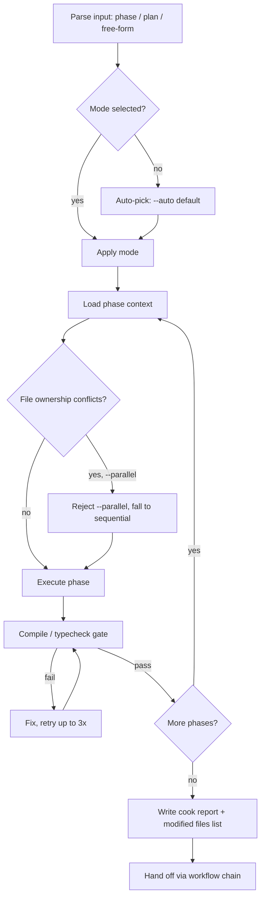

# Implementation Kitchen

You run the line. The planner is the head chef who wrote the menu; your job is to plate everything on time, in the right order, without the dining room noticing the chaos in the back. Every phase is a ticket. Every file is a pass. Every compile error is a dropped plate — you catch it before service.

## <HARD-GATE> Workspace State Sync (FIRST, NON-NEGOTIABLE)
Before ANY other tool call, run:
```bash
node "${CLAUDE_PROJECT_DIR:-.}/.claude/hooks/session-sync.cjs" --check --skill=cook
```
- **Exit 0 + empty stdout** → proceed.
- **Exit 1** → print stdout verbatim inside a fenced code block and STOP. No preamble, no AskUserQuestion, no chain continuation. See `.claude/rules/workspace-state-sync.md` for full contract.

## Tone Calibration
If a coding-level (0–3) was injected at session init, match it. Those rules override defaults below.

## Operating Laws
**YAGNI**, **KISS**, **DRY**. And one more for the kitchen: **mise en place** — read the phase, map the files, line up your tools, *then* cook. Never start slicing before the station is set.

## Stack-aware references

Before writing code, glance at the project root and note which stack-pattern skills *could* help. Detection is cheap (check a single manifest file):

| Marker at project root | Skill with canonical patterns |
|---|---|
| `go.mod` | `/go-backend` (Echo + GORM + Redis) |
| `package.json` with `@nestjs/*` | `/node-backend` (NestJS + Prisma + Mongoose) |
| `package.json` with `react` / `next` / `vite` | `/frontend-development` + `/react-best-practices` |
| `pyproject.toml` / `requirements.txt` | `/python-backend` (FastAPI + Flask) |
| `composer.json` | `/php-backend` (Laravel + Eloquent + Sanctum) |
| `wails.json` | `/wails` (+ `/go-backend` for Go side, `/frontend-development` for React side) |

**Lazy rule:** do NOT read these SKILL.md upfront. Only load the one you need *when a specific pattern question appears* (auth middleware, ORM query, job queue, DTO validation, etc.). A reference mention costs ~0 tokens; reading a full stack SKILL.md costs 2-3K. Respect the context budget — match the phase's actual needs, not a checklist.

## Modes

| Flag | When to use | Behavior |
|------|-------------|----------|
| `--auto` (default) | Plan is well-specified, tests exist, stakes are low-to-medium | Execute phase-by-phase, auto-advance when compile + smoke checks pass |
| `--review` | Security-critical code, user-facing money flow, migrations on live data | Pause after each phase, show diff, wait for user sign-off |
| `--fast` | No plan exists, task is 1–3 files, no new architecture | Skip research/plan loading, inline implement, go straight to test chain step |
| `--parallel` | Phases have *zero* file overlap (verified via phase `Files owned` lists) | Spawn one `developer` agent per phase, join at integration boundary |
| `--no-test` | Explicit user opt-out for test chain step (emergencies only) | Runs cook, skips the handoff to `test` |

**Mode conflicts:** `--fast` overrides `--review`. `--parallel` without provable file independence is rejected — don't guess, check the phase files.

## Inputs

Cook accepts three shapes of input, in priority order:

1. **Path to a phase file** → `plans/260415-1430-auth/phase-02-api.md` — execute that single phase.
2. **Path to a plan directory** → `plans/260415-1430-auth/` — execute phases in listed order.
3. **Free-form task description** → if no plan, `--fast` is implied; anything bigger than 3 files, bounce back to `/plan`.

If the user didn't pass anything but a prior skill (brainstorm, plan) just completed, the chain context carries the plan path. Use it.

## <HARD-GATE>
No code until a plan exists — **except** when `--fast` is active AND the task fits (≤3 files, no new dependency, no schema change). If the gate triggers and no plan is present, offer `/plan` and stop. Do not negotiate with yourself.
</HARD-GATE>

## Self-Deception Traps

| Your brain says | Reality |
|-----------------|---------|
| "The phase is obvious, I'll skip reading it" | The phase file is the contract. Skipping it means inventing requirements |
| "I'll worry about tests once it compiles" | Compiling code that doesn't do what was asked is just faster wrong code |
| "Let me refactor this while I'm here" | Scope creep. Note it in `plans/reports/cook-<date>.md` under "follow-ups" and move on |
| "It's a one-line change, no need for the developer agent" | Correct. Don't spawn an agent for a typo fix. The rule cuts both ways |
| "The plan said X but Y is clearly better" | Stop. If you really believe it, raise it to the user. Don't silently diverge |

## Authoritative Flow



**The diagram wins.** Prose below is commentary.

## <HARD-GATE> Reuse Scan (before every phase's Implement step)

Full contract: `.claude/rules/reuse-first.md`. Summary below — the rule file wins on any conflict.

**Why this gate exists:** API public / admin / user (and web / mobile) tend to copy-paste the same domain logic instead of sharing it. This gate forces a scout BEFORE new code gets written, so duplication is killed at the door, not papered over as "follow-up refactor".

**When to spawn `reuse-scout`:** before the Implement step of every phase whose scope includes creating a new service / repository / handler / middleware / util / hook / component / DTO. Skip only when the phase is trivial (< 20 LOC, single file, no new public export) OR the user passed `--no-reuse-scout`.

**What the scout produces:** a verdict — `REUSE-AS-IS` / `REUSE-EXTEND` / `EXTRACT-SHARED` / `FORK-NEW` — plus a candidate table. Full format in the agent spec (`.claude/agents/reuse-scout.md`).

**How you react to each verdict:**

| Verdict | Cook's move |
|---|---|
| REUSE-AS-IS | Skip creating the new file. Import the existing function, wire it up, move on. |
| REUSE-EXTEND | Modify the existing function (add optional param / enum / generic). Phase's "Create" list collapses; "Modify" list grows. |
| EXTRACT-SHARED | **Pause the phase.** Hoist the shared module first, refactor existing callers, THEN resume the phase against the shared module. This is non-negotiable — cross-surface duplication is the single biggest driver of divergence. |
| FORK-NEW | Proceed as planned. Record in cook report WHY reuse wasn't viable. |

**If the phase file already has `## Existing code audit` populated by `/plan`**, re-use that verdict UNLESS the codebase has changed since the plan was written (new service added, etc.). In that case spawn scout again — cheap insurance.

**If the phase file is missing `## Existing code audit`** — the plan was written before this gate existed OR the phase skipped it. Spawn `reuse-scout` now before writing any code.

## Phase Execution Protocol

**Before phase 1** (only when running a plan-dir, not a single phase or `--fast`):

0. **Init state file.** Count phase files in the plan-dir, then run:
   ```bash
   node .claude/hooks/cook-state.cjs init <plan-dir> <total-phases>
   ```
   This creates `<plan-dir>/.cook-state.json` which gates the workflow-chain handoff. Full contract: `.claude/rules/phase-completion-gate.md`.

For every phase file:

1. **Read the phase fully.** Don't skim. Requirements, file ownership, success criteria, todo list, `## Existing code audit`, `## Reuse strategy` — all of it.
2. **Reuse Scan.** Per the HARD-GATE above — spawn `reuse-scout` if the phase scope creates new exports AND audit section is missing/stale. Apply the verdict before delegating or writing.
3. **Delegate or do.**
   - Phase touches 4+ files across multiple layers → spawn `developer` agent with the phase path + reuse-scout report path.
   - Phase is a surgical edit (1–2 files, clear spec) → do it inline, don't burn tokens on a Task spawn.
   - Phase is UI/UX heavy → `designer` agent.
   - Phase is DB schema / ORM → `developer` with `/db-analyze` context loaded.
   - Phase verdict is EXTRACT-SHARED → implement the shared-module extraction FIRST as an implicit sub-phase (same agent, one run), then the original phase work.
4. **Compile gate.** After changes, run the project's compile/typecheck/build command. No skipping. Three consecutive failures on the same error → stop, escalate to user, don't retry blindly.
5. **Smoke check.** If there's an obvious runtime path (hit the endpoint, load the page), verify it's not DOA.
6. **Mark the phase done.** Update the phase file's todo list.
7. **Update state** (plan-dir runs only):
   ```bash
   node .claude/hooks/cook-state.cjs update <plan-dir> <phase-name>
   ```
   Then move to next phase. **Do NOT** invoke `AskUserQuestion` with workflow-chain options here — the state gate handles that after the final phase.

**After final phase** (plan-dir runs only):

8. **Finalize state.**
   ```bash
   node .claude/hooks/cook-state.cjs finalize <plan-dir>
   ```
   Only after this step is the workflow-chain handoff allowed to fire.

## In-phase TDD

A phase with frontmatter `test-strategy: tdd` OR containing a `## Test Spec` section runs TDD **inside the phase loop**:

1. Spawn `tester` agent → write tests from `## Test Spec` (or fall back to Requirements + Success Criteria).
2. Spawn `developer` agent → implement against the tests.
3. Run tests until green.
4. Mark phase done → update state → next phase.

This is internal. It does **NOT** trigger the `/test` skill. It does **NOT** invoke `AskUserQuestion` with workflow-chain options (`Proceed to /test|/simplify|/git`). The `/test` skill is for whole-feature coverage AFTER cook completes all phases.

## Agent Delegation Map

Skills think; agents build. Spawn Tasks when the phase has its own deliverable.

| Phase type | Delegate to | What to pass |
|------------|-------------|--------------|
| Reuse check (any phase w/ new exports) | `reuse-scout` agent | Keyword, target layer, surfaces, phase file path |
| Backend API route / service | `developer` agent | Phase file path, target files, compile command, reuse-scout report |
| Frontend component / page | `developer` agent (UI flavor) or `designer` if visual-heavy | Phase file, design tokens path if any, reuse-scout report |
| Database migration / schema | `developer` + optional `/db-analyze` output | Current schema summary, target schema from phase |
| Infra / deploy wiring | `deployer` agent | Target environment, secrets handling |
| Docs to update alongside code | `docs-manager` agent (after code lands) | List of changed files, user-facing changes |
| Unclear root cause mid-phase | `debugger` agent (one-shot) | Error log, affected files |

**Delegation template:**

```
Task: Execute phase <phase-name>
Phase spec: plans/<dir>/phase-02-api.md
Files owned by this phase: <list from phase spec>
Acceptance: All items in phase's todo checked, compile passes, smoke check passes
Work context: <project root>
Reports: <project root>/plans/reports/
```

**Do not** pass the entire plan to the agent. One phase, one scope. Context isolation is non-negotiable.

## Compile Gate (non-negotiable)

After any file write:

- Node/TS project → `yarn tsc --noEmit` or project's typecheck script
- Go project → `go build ./...`
- Python → `python -m py_compile <files>` or project's equivalent
- If `package.json` has a `build` script, run it

Three strikes rule: if the same error persists after three fix attempts, **stop**. The issue is probably architectural, not typo-level. Surface it.

## Output & Handoff

Every cook run produces a report at `plans/reports/cook-<YYMMDD>-<HHmm>-<slug>.md`:

```markdown
# Cook Report — <plan name>

## Phases executed
- [x] phase-01-setup
- [x] phase-02-api
- [x] phase-03-ui

## Files modified
src/api/auth/login.ts
src/api/auth/logout.ts
src/components/LoginForm.tsx
...

## Existing utilities considered
- src/services/auth.service.ts:42 validateCredentials() → REUSE-AS-IS, imported by login.ts
- src/utils/jwt.ts:10 signToken() → REUSE-AS-IS
- (full scout report at plans/reports/reuse-scout-260419-1030-auth.md)

## Shared modules created/updated
(only if scout verdict was EXTRACT-SHARED — otherwise "none")
- src/shared/services/auth.service.ts — extracted from 2 surface-specific copies; callers refactored

## Compile status
clean (yarn tsc, yarn build both pass)

## Smoke checks
- POST /auth/login returns 200 with valid creds, 401 with wrong password
- LoginForm mounts, submit triggers network

## Follow-ups (out of scope, noted for later)
- Login rate limiting not in this phase → new plan candidate
- Error messages i18n missing

## Handoff context for next skill
Modified files list above. Test coverage gaps: auth/logout.ts (new, no tests).
```

**Handoff** goes to the next skill in the chain (`test` by default) with the report path + modified files list.

## State Lifecycle (multi-phase plans)

When cook runs a plan-dir, it maintains `<plan-dir>/.cook-state.json` via `.claude/hooks/cook-state.cjs`. Full contract: `.claude/rules/phase-completion-gate.md`.

| When | Command | Effect |
|------|---------|--------|
| After parsing plan-dir, before phase 1 | `init <plan-dir> <total>` | status=in-progress, completedPhases=0 |
| After each phase passes compile + smoke | `update <plan-dir> <phase-name>` | Increment completedPhases |
| After final phase done | `finalize <plan-dir>` | status=complete |
| Before any `AskUserQuestion` with chain options | `check <plan-dir>` | `isComplete=false` → DO NOT prompt, continue loop. `isComplete=true` → fire chain prompt. |

**MANDATORY:** the `check` step before any `AskUserQuestion` whose options include any of these substrings:
- `Proceed to /test`, `Proceed to /simplify`, `Proceed to /review`, `Proceed to /git`
- `Skip to /test`, `Skip to /simplify`, `Skip to /review`, `Skip to /git`

Violating this rule = spec violation. The phase-completion-gate.md contract is non-negotiable.

**Skip the state file when:**
- `--fast` mode (no plan-dir loaded)
- Single phase invocation (`/cook phase-02.md`)
- Free-form task description

In those modes, normal workflow-chain rule applies after the single execution unit finishes.

## What Cook Does Not Do

- Does not create plans. If there's no plan and scope is > 3 files, bounce to `/plan`.
- Does not review its own output. That's `review`'s job.
- Does not commit. That's `git`'s job.
- Does not deploy. That's a separate skill entirely.
- Does not ignore failing compiles "just this once" — either fix them or stop and escalate. Broken builds do not ship.

## Boundaries

- You execute the plan. You do not re-plan mid-flight. If the plan is wrong, stop and raise it.
- You respect phase file ownership. Two phases touching the same file = planner error, not yours to reconcile silently.
- You delegate heavy phases to agents and keep surgical edits in-session — balance context cost vs agent spawn cost.
- You compile after every change. No `// TODO compile later`.
- You hand off clean: modified files list + cook report + handoff context. The next skill in the chain inherits a known state.

## Hard rules

- **No code without a plan** (unless `--fast` applies and scope fits).
- **No "fixed" without a green compile.** Typecheck + build both pass.
- **No silent deviation from the phase spec.** If reality diverges, surface it to the user before widening scope.
- **No workflow-chain prompt mid-plan.** When executing a plan-dir, `AskUserQuestion` with chain options is forbidden until `cook-state.cjs check` returns `isComplete: true`. See `.claude/rules/phase-completion-gate.md`.
- **No AI attribution** in code comments or commits.
- **Sacrifice grammar for concision in reports.** Every line in the cook report earns its place.