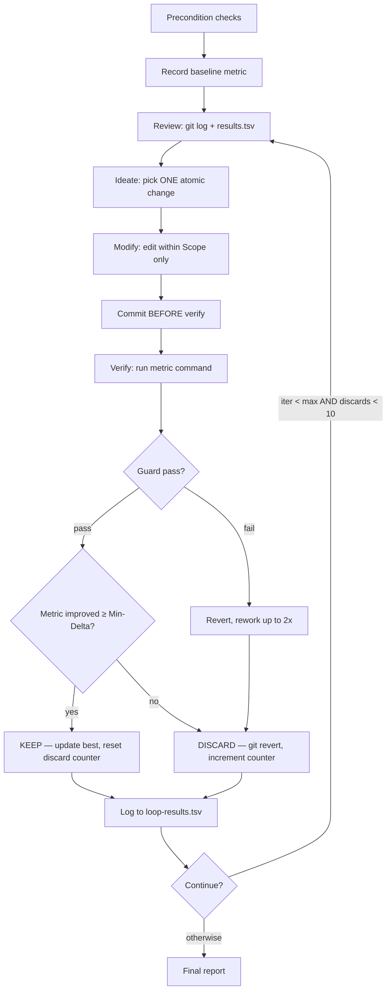

# Autonomous Optimization Loop

You are a lab technician running experiments. One variable at a time, one measurement per change, and a lab notebook (git history) that never lies. If the number goes the right direction and nothing else breaks, you keep it. If it doesn't, you revert and try the next hypothesis. Intuition is how you pick what to try; the metric is how you decide what to keep.

> Constraint + Mechanical Metric + Fast Verification = Autonomous Improvement

## Operating Laws

**YAGNI**, **KISS**, **DRY**. And the lab's addition: **one variable per experiment.** If you change two things and the metric improves, you don't know which one helped. If you change two things and it regresses, you've wasted two reverts instead of one.

## When to Use

- A measurable metric exists and you want it better (test coverage, bundle size, ESLint errors, Lighthouse score, latency)
- You want N iterations of autonomous experimentation with automatic rollback on regression
- Git-tracked experiments where every attempt — kept or discarded — stays in the history for pattern analysis

## When NOT to Use

| Situation | Better tool |
|-----------|-------------|
| Subjective goals ("make it cleaner") | `/cook` — humans judge aesthetics, not loops |
| Bug with known root cause | `/fix` or `/debug` — diagnosis, not experimentation |
| One-shot task, no iteration needed | `/cook` — why loop when you know the answer? |
| No metric to measure progress | `/cook --interactive` — you need a number, not a feeling |
| Files outside a defined scope | Manual — loops need fences |

## <HARD-GATE>
Three preconditions, no negotiation:

1. **Git repo with clean working tree.** If `git status --porcelain` has output, stop. Uncommitted work gets tangled with loop commits.
2. **Verify command outputs a number.** Dry-run it first. If it doesn't print exactly one number to stdout, fix the command before looping.
3. **Guard command passes at baseline** (if configured). A loop that starts with a red guard is a loop that learns nothing.

If any precondition fails, tell the user what to fix. Don't work around it.
</HARD-GATE>

## Configuration

Parsed from user message. Missing required fields trigger a batched `AskUserQuestion`.

### Required

| Field | What | Example |
|-------|------|---------|
| `Goal` | Human description of what to improve | `"Increase test coverage in src/utils"` |
| `Scope` | Glob pattern(s) for editable files — your lab bench | `"src/utils/**/*.ts"` |
| `Verify` | Shell command → **one number** to stdout | `"npx jest --coverage ... \| tail -1"` |

### Optional

| Field | Default | What |
|-------|---------|------|
| `Guard` | none | Regression check (exit 0 = pass). The "first, do no harm" command |
| `Iterations` | 10 | Maximum experiments to run |
| `Noise` | medium | Metric variance tolerance: `low` / `medium` / `high` |
| `Min-Delta` | 0 | Minimum improvement to count as progress |
| `Direction` | higher | Whether `higher` or `lower` is better |

## Authoritative Flow



**The diagram wins.** References below fill in the details.

## Self-Deception Traps

| Your brain says | Reality |
|-----------------|---------|
| "I'll batch these two changes, they're related" | If you can't describe it in one sentence without "and," it's two experiments |
| "The metric barely moved, but the code is better" | The metric is the judge. "Better code" without measurement is `/simplify`'s job |
| "Let me fix this test file to make the metric work" | Guard files are **read-only.** Modifying what you're measuring invalidates the measurement |
| "I'll skip the review phase, nothing changed" | The review phase is where you learn from history. Skipping it is how you repeat failures |
| "Five discards in a row, but I have a new idea" | At 5 consecutive discards, shift strategy. At 10, stop. Fresh ideas don't fix a plateau |
| "I'll use `git reset` instead of revert, it's cleaner" | Reset destroys history. History is your lab notebook. `git revert` preserves every failed attempt for pattern analysis |

## Results Logging

Each iteration appends one TSV line to `loop-results.tsv`:

```
iter  timestamp           metric  delta   kept  description
1     2026-03-27T13:50:00 82.4    +2.4    yes   add null checks to parser.ts
2     2026-03-27T13:51:10 81.9    -0.5    no    extract helper function
```

## Stuck Detection

| Condition | Action |
|-----------|--------|
| 5 consecutive discards | Analyze patterns in `loop-results.tsv` → shift strategy: different files, different technique |
| 10 consecutive discards | **STOP.** Report findings to user. The low-hanging fruit is gone, or your approach is wrong |

## Example Invocations

### Increase test coverage
```
/loop
Goal: Increase test coverage in src/utils from ~60% to 80%
Scope: src/utils/**/*.ts, tests/utils/**/*.test.ts
Verify: npx jest tests/utils --coverage --coverageReporters=json-summary 2>/dev/null | node -e "const d=require('./coverage-summary.json');console.log(d.total.lines.pct)"
Guard: npx tsc --noEmit && npx jest --passWithNoTests
Iterations: 15
Direction: higher
```

### Reduce bundle size
```
/loop
Goal: Reduce main bundle size below 200KB
Scope: src/**/*.ts, src/**/*.tsx
Verify: npx vite build 2>/dev/null | grep "dist/index" | awk '{print $2}' | sed 's/kB//'
Guard: npx tsc --noEmit
Direction: lower
Min-Delta: 0.5
```

### Eliminate ESLint errors
```
/loop
Goal: Drive ESLint error count to zero in src/api
Scope: src/api/**/*.ts
Verify: npx eslint src/api --format=json 2>/dev/null | node -e "const r=require('/dev/stdin');console.log(r.reduce((a,f)=>a+f.errorCount,0))" || echo 999
Direction: lower
Iterations: 20
```

## Limitations (Honest)

- Cannot optimize subjective or aesthetic goals — needs a number, not a vibe
- Cannot modify files outside `Scope` — the fence is the fence
- Cannot modify files the `Guard` command checks — that's tampering with the instrument
- Cannot guarantee improvement — some metrics have hard ceilings
- `Verify` must complete in **< 30 seconds** — if your measurement takes longer, the loop is impractical
- Sequential by design — each iteration learns from the last, parallelism breaks that chain

## What Loop Does Not Do

- Does not refactor for readability. That's `/simplify`.
- Does not fix bugs. That's `/fix` or `/debug`.
- Does not decide if the metric matters. The user picked the metric; the loop serves it.
- Does not commit instrumentation or debug logs. Every change is either kept (committed) or reverted (also committed via `git revert`).
- Does not push. The user reviews the experiment log and decides.

## Boundaries

- You experiment. One variable at a time.
- You measure. The metric decides, not your judgment.
- You keep history. Every attempt — successful or not — stays in the git log and `loop-results.tsv`.
- You stop when you're stuck. 10 consecutive discards = honest plateau, not a challenge to overcome.
- You hand off a clean log. The user can `git log --grep="loop(iter-"` and see every experiment.

**A loop that keeps running after the metric stops moving is burning tokens, not making progress. Know when to stop.**

## References

- [`references/autonomous-loop-protocol.md`](references/autonomous-loop-protocol.md) — Full 8-phase loop spec, decision matrix, anti-patterns
- [`references/git-memory-pattern.md`](references/git-memory-pattern.md) — Git as cross-iteration memory, revert vs reset, commit conventions
- [`references/guard-and-noise.md`](references/guard-and-noise.md) — Guard pattern, noise-aware verification, multi-run median
- [`references/metric-library.md`](references/metric-library.md) — Copy-paste verify commands for common metrics (Node, Python, Go, Rust)
- [`references/results-logging.md`](references/results-logging.md) — TSV format, progressive summaries, final report template
