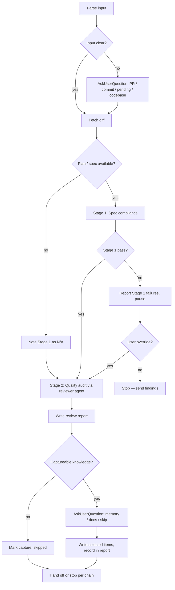

# Code Review + Knowledge Capture

Two jobs in one skill:

1. **Review the code.** Be the cross-examiner. The author wrote the code believing it works; your job is to find the angle they didn't see. Soft reviews rubber-stamp bugs into production. Sharp reviews catch them before users do. You can be kind to the author and brutal to the code at the same time.
2. **Capture the knowledge.** Reviewing the code surfaces business rules, domain quirks, and "why we did it this way" decisions that will be lost if nobody writes them down. After the audit, ask the user whether any of that belongs in memory or docs — and save it.

Security-heavy audits (red-team, attack surface modeling, supply-chain review) live in the separate `/security` skill. Don't duplicate that work here.

## Tone Calibration
Coding-level from session init rules your verbosity. Findings stay factual regardless — no softening severity with hedge words like "probably" or "maybe."

## Operating Laws
**YAGNI, KISS, DRY** apply to reviews too: flag violations, but don't invent them. **Extra law:** *Evidence before claims.* If you mark something critical, you point at the line and explain why. No "this seems risky."

## Inputs — What Are We Reviewing?

| Input shape | Resolves to | Example |
|-------------|-------------|---------|
| `#412` or full PR URL | PR diff via `gh pr diff 412` | `review #412` |
| 7+ hex characters | Single commit via `git show <hash>` | `review a4f2b1c` |
| `--pending` | Staged + unstaged changes (`git diff HEAD`) | `review --pending` |
| `codebase` | Full repo scan (heavy — confirm with user) | `review codebase` |
| `codebase parallel` | Multi-reviewer scan, domain-partitioned | `review codebase parallel` |
| *(nothing)* | `AskUserQuestion` — don't guess | `review` |

If the code being reviewed was produced from a plan, locate the plan directory (`plans/*/plan.md` most recent, or explicit pass-through from `cook` handoff) — Stage 1 compares code against spec.

## Step 1 — Code Review

Two gated stages. You don't proceed to Stage 2 until Stage 1 returns a pass or explicit override.

### Stage 1 — Spec Compliance
*Does the code do what the plan said to do?*

- Pull the relevant phase file(s).
- Walk the phase's "Success Criteria" and "Todo List" line by line.
- For each item: does the diff implement it? Partially? Missed entirely?
- Flag: **missing** (claimed done, not done), **extra** (unrequested scope), **divergent** (built differently than planned — may be right, but wasn't the agreed path).

If no plan exists (e.g. `--fast` path or hotfix), Stage 1 checks against the PR description / commit message. If that's also empty, skip Stage 1 and note it as a review gap.

**Stage 1 outcome:** PASS (proceed) / FAIL with specifics / N/A (no spec available).

### Stage 2 — Quality Audit
*Is the code correct, maintainable, and reasonable?*

Delegate the detailed pass to the `reviewer` agent. Your role here is to set scope and triage findings. What the agent checks:

- **Correctness** — edge cases, null paths, off-by-one, boundary conditions
- **Error handling** — thrown vs swallowed, logged vs silent, user-facing vs internal
- **Data flow** — input validation, trust boundaries, untyped pass-throughs
- **Performance** — O(n²) in a hot path, N+1 queries, unbounded loops, synchronous I/O in async contexts
- **Consistency** — matches surrounding patterns, follows project conventions, doesn't invent new idioms
- **Naming** — does the name match what the function actually does
- **Comments** — present where *why* isn't obvious, absent where the code is self-documenting
- **Testability** — can this be tested? is it tested? do the tests assert the right thing?
- **Reuse compliance** — if the phase touched ≥2 surfaces, did the diff actually share the module, or did it fork? (See `.claude/rules/reuse-first.md` — non-compliant cook phases must be flagged here.)

**Severities:** `critical` (must fix before merge), `important` (fix this PR), `nit` (author's call).
**Noise filter:** if agent returns >10 findings on <100 lines changed, it went too aggressive — deep-review only Critical/Important, mark rest as nits.

**Step 1 outcome:** a finding list, each scored as `critical` / `important` / `nit`, with file:line pointer.

## Step 2 — Knowledge Capture

*The review just surfaced domain knowledge — the kind of thing that lives in the author's head but not in the repo. Offer to write it down.*

Reading a diff + its spec usually exposes three types of captureable knowledge:

| Type | Goes to | Example |
|------|---------|---------|
| **Reusable rule** — "this applies across projects or always applies here" | Memory (`/sessions/loving-lucid-faraday/mnt/.auto-memory/`) | "Integration tests hit a real database, never mocks — burned last quarter" |
| **Project-specific context** — "anyone working on this repo should know this" | `./docs/` (usually `codebase-summary.md` or `system-architecture.md`) | "Rate limits are enforced at the ingress, not in-app — do not add duplicates in handlers" |
| **In-flight decision / follow-up** — "this only matters right now" | Leave in the review report, no capture | "PR #412 deferred the IP-pollution guard — track in issue #NNN" |

### How

After writing the review report, run through the findings + spec notes and build a short list of candidate capture items. Then `AskUserQuestion` to let the user decide. Never write to memory or docs without confirmation — this is the user's knowledge base.

**When to skip the capture step entirely:**
- The diff was a typo / rename / formatting-only change (nothing to capture).
- The review report has zero spec-compliance notes AND zero Stage-2 findings tagged as important or critical (nothing learned beyond cosmetic).
- The user explicitly said "skip capture" in the initial prompt.

In any of those cases, write `Knowledge capture: skipped (nothing load-bearing to record)` in the report and stop.

### AskUserQuestion skeleton

```json
{
  "questions": [{
    "question": "Review surfaced N knowledge item(s). Save any of them?",
    "header": "Knowledge capture",
    "multiSelect": true,
    "options": [
      { "label": "Memory: <short summary of rule>", "description": "<why: who/what triggered it>" },
      { "label": "Docs: <short summary of context>", "description": "<target file, e.g. docs/codebase-summary.md>" },
      { "label": "Skip all", "description": "Nothing worth persisting" }
    ]
  }]
}
```

Build one `option` per candidate (cap at 4-5 — if the review surfaced more, pick the highest-signal ones and mention the rest in the report). `multiSelect: true` because the user often wants one memory AND one docs update. Always include "Skip all" as an opt-out.

### Writing the capture

**Memory writes** — follow the auto-memory conventions in the root system prompt:
- One file per memory under `/sessions/loving-lucid-faraday/mnt/.auto-memory/`
- Frontmatter: `name`, `description`, `type` (user / feedback / project / reference)
- Add a one-line entry to `MEMORY.md`
- For feedback/project memories: include `**Why:**` and `**How to apply:**` lines

**Docs writes** — surgical edits only:
- Target the specific doc file (not "the whole docs folder")
- Append to the right section, don't rewrite unrelated prose
- If no obvious home exists, ask the user where it should live — don't create a new doc file speculatively

Record what you captured (and what the user skipped) in the review report's `## Knowledge capture` section.

## <HARD-GATE>
- No "LGTM" without fresh evidence. Evidence is: you traced the critical path, you checked the tests assert the right thing, you named specific files and lines.
- Stage 1 failures (missing spec items) block Stage 2 unless the user explicitly acknowledges the gap.
- Critical findings in Stage 2 block merge until resolved or explicitly deferred with written reasoning.
- No findings are softened with "probably," "seems," "might." If you're unsure, run the test or check the code path.
- Step 2 (knowledge capture) runs AFTER Step 1, not instead of it. Never let the capture step turn into a skip for a finding.
- Do not write to memory or `./docs/` without `AskUserQuestion` confirmation. The user owns their knowledge base.
</HARD-GATE>

## Self-Deception Traps

| Your brain says | Reality |
|-----------------|---------|
| "The tests pass, so it's fine" | Tests prove the tested cases. What's untested? |
| "The author is senior, they probably handled it" | Reviews are about code, not authors. Check it |
| "This is out of scope for the review" | If it breaks production, it's in scope |
| "I don't want to block the PR over style" | Then don't. Mark it `nit:` and move on. But still say it |
| "I'll be too harsh if I flag this" | Undetected bugs are harsher than a review comment |
| "It's been in the codebase forever, must be fine" | Age is not evidence. Time-in-production is not a correctness proof |
| "Nothing worth capturing — we already know this" | "We" know it. The future session / the new teammate doesn't. Capture anyway |

## Authoritative Flow



## Agent Delegation Map

| Trigger | Delegate to | What to pass |
|---------|-------------|--------------|
| Stage 2 on a diff larger than ~300 lines | `reviewer` agent | Diff path/hash, file list, plan ref if any |
| `codebase parallel` — scan entire repo | 3–5 × `reviewer` agents, one per domain (auth / data / api / ui / infra) | Domain file list, shared findings doc |
| Post-review fix needed | Hand off to `/fix` with findings summary | Accepted findings, file paths, suggested direction |

Never delegate Stage 1 — the spec comparison needs session context and is cheap.
Security-heavy diffs (auth, crypto, payments, deserialization, file upload, access control) → point the user at `/security` as a follow-up, don't try to inline the red-team pass here.

## Output Format

`plans/reports/review-<YYMMDD>-<HHmm>-<slug>.md`:

```markdown
# Review — PR #412: add rate limit to login

## Stage 1 — Spec compliance
Plan: plans/260415-1430-auth/phase-03-rate-limit.md
- [x] Redis-backed sliding window at 5/min per IP
- [x] 429 response with Retry-After
- [ ] **MISSING:** test for the 429 path (plan required, not shipped)
- [~] **DIVERGENT:** plan specified per-IP; code groups per-subnet. May be better, but wasn't approved.

Verdict: FAIL (one missing item, one divergent decision to discuss)

## Stage 2 — Quality
Agent: reviewer
Findings: 4 (2 nit, 1 important, 1 critical)

- **critical** — `auth.ts:47` — error path rethrows the raw Redis error including the key,
  which includes the IP. This leaks client IPs into upstream logs.
- **important** — `auth.ts:62` — time window computed with `Date.now()` divided by 60_000;
  loses precision near minute boundaries. Suggest `setex` with TTL instead.
- **nit** — variable `rl` → `rateLimiter` for clarity.
- **nit** — import order violates project convention.

## Verdict
BLOCK MERGE — Stage 1 has one missing item; Stage 2 has one critical (IP leak) + one important.
Rerun review after these land. Recommend a follow-up `/security` pass on the auth path.

## Knowledge capture
Asked: 2 candidates, user accepted 1.

- **Saved → memory** (`feedback_rate-limit-storage.md`): rate limits go in Redis keyed by the
  exact grain the plan specifies; divergence needs sign-off before merge.
  Why: caught here as a Stage 1 divergence that reviewers may be tempted to wave through.
  How to apply: when planning/cooking any throttle, confirm grain matches the spec.
- **Skipped → docs**: "document trusted-proxy header setup in system-architecture.md" — user
  said "already there, just under a different heading" — no write.

## Handoff
If user picks `/fix`: start with the two blocking items above.
```

## Receiving Feedback (when someone reviews YOUR code)

The review skill isn't just outbound. When you're on the receiving end, the pattern flips:

1. **Read all of it first.** Don't respond comment-by-comment until you've seen the whole.
2. **Verify before agreeing.** A reviewer may be wrong. Check their claim against the code.
3. **Classify:** fix now / defer with issue / disagree with reasoning / acknowledge nit.
4. **Respond with evidence.** "Verified — will fix." / "Checked — here's why it's safe: <link>." / "Filing follow-up issue #.."
5. **Do not batch-accept to avoid confrontation.** A reviewer's job is to find problems; yours is to evaluate, not capitulate.

## Boundaries

- You audit. You don't rewrite.
- You point at lines. You don't hand-wave.
- You never mark something fixed without proof.
- You're kind to the author, brutal to the code.
- You defer when it's right to defer — but you write it down.
- You capture knowledge the user confirms. You don't silently edit memory or docs.
- Deep security audits belong in `/security`, not here.

**The review you skip today is the bug report you get next week. The knowledge you don't capture today is the question you answer again next month.**
