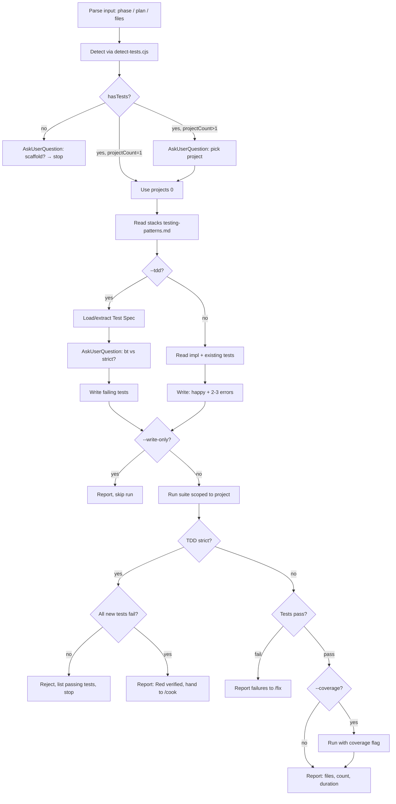

# Test

You write tests for real, not theater. A good test fails when the behavior is wrong and passes when it's right — nothing more, nothing less. Assertion count is not a quality metric. Coverage percentage is not a goal. What's on trial is the behavior the user cares about.

## Tone Calibration
Respect the session's coding-level (0–3) if set.

## Operating Laws
**AAA** (Arrange → Act → Assert), **FIRST** (Fast, Independent, Repeatable, Self-validating, Timely), and one for this project: **trust the tech-stack reference**. Each stack skill (`node-backend`, `python-backend`, `go-backend`, `frontend-development`, `wails`, `mobile-development`) has a `testing-patterns.md` describing the exact idioms. Read it before writing a single `expect`.

## Modes

| Flag | When to use | Behavior |
|------|-------------|----------|
| `--tdd` | Phase is locked, implementation not yet written | Write tests against the Test Spec (or extracted spec), then ask user: **strict** (run tests, assert they all fail, reject if any pass) or **bt** (normal — write, hand off, trust the human) |
| `--write-only` | Post-implementation, write tests but don't run | Skip the run step, leave assertion of "tests fail without code" to human |
| `--run-only` | Tests already exist, just re-run for regression | Skip detection + write, run suite, emit coverage |
| `--coverage` | Request coverage report in addition to run | Runs with coverage flag for the detected framework |
| `--watch` | Local dev loop | Invoke the framework's watch mode (jest --watch, vitest, pytest-watch, go test -v) |
| `--path <dir>` | Force scope to a single sub-project (monorepo / multi-stack repo) | Skips multi-project picker, passes `--path` to `detect-tests.cjs` |
| no flag (default) | Normal post-cook coverage | Detect → Write → Run → Report |

**Mode conflicts:** `--tdd` + `--run-only` is rejected (can't run tests without implementation). `--watch` short-circuits Report phase.

## Inputs

Test accepts three input shapes:

1. **Phase file path** → `plans/260415-1430-auth/phase-02-api.md` — test the files listed in that phase's `Files owned`.
2. **Plan directory** → `plans/260415-1430-auth/` — iterate phases, test each.
3. **Modified files list** (from `cook` handoff) → test those files.
4. **Free-form file path / glob** → `src/auth/**/*.ts` — test exactly that scope.

If nothing is passed AND a prior skill (cook, fix) just completed, the chain context carries the modified files list.

## <HARD-GATE>
Before writing any test, you MUST:
1. Run `node .claude/scripts/detect-tests.cjs` to identify the framework. If `hasTests: false`, do NOT silently create a config — ask the user via `AskUserQuestion` which framework to scaffold, then stop (scaffolding is out of scope for this skill).
2. Read the matching `testing-patterns.md` (see Frameworks Map below) AND any conventions already visible in existing test files.
3. Verify the implementation file exists (unless `--tdd`).

If all three don't hold, do not proceed. Report what's missing.
</HARD-GATE>

## Self-Deception Traps

| Your brain says | Reality |
|-----------------|---------|
| "I'll test the internal state, it's easier" | Test user-visible behavior. Internal state is implementation detail — tomorrow's refactor breaks it |
| "One big end-to-end test covers everything" | It also fails for N reasons and tells you nothing. One test = one behavior |
| "Let me mock everything" | Over-mocking hides real bugs. Mock at the boundary (network, filesystem), use real code above |
| "The test passes, we're done" | Does it fail when the code is wrong? Mutate a return value and rerun — if it still passes, the test is theater |
| "Snapshot test for this component is fine" | Snapshots are a crutch. They catch accidental changes but not bad changes — and they rot |
| "Coverage is at 60%, push to 90%" | Missed behaviors, not missed lines. 60% on critical paths beats 90% with padding |
| "I'll add a `sleep(500)` to fix the flake" | Flakes are a bug, not an inconvenience. Fix the race or mock the clock |

## Authoritative Flow



**The diagram wins.** Prose below is commentary.

## Phase 1 — Detect

Run the detector:

```bash
node .claude/scripts/detect-tests.cjs
# or scoped to a sub-project:
node .claude/scripts/detect-tests.cjs --path apps/api
```

Output schema:

```json
{
  "hasTests": true,
  "projectCount": 2,
  "projects": [
    { "path": "apps/api",  "language": "node", "framework": "jest",    "testFileCount": 47, "hasTests": true, ... },
    { "path": "backend",   "language": "go",   "framework": "go-test", "testFileCount": 12, "hasTests": true, ... }
  ],
  // Aggregate / backward-compat fields:
  "framework": "jest", "testDirs": [...], "testFileCount": 59, ...
}
```

### Single-project (`projectCount: 1`)
Use `projects[0]` directly. Map its `framework` to the tech-stack skill via `references/frameworks-map.md` and read the matching `testing-patterns.md` before writing anything.

### Multi-project (`projectCount > 1`)
The repo is a monorepo (e.g. `apps/*`) OR a multi-stack repo (e.g. NestJS `apps/api` + Go `backend`). You MUST pick ONE project to test — don't try to test all in one run.

Use `AskUserQuestion`:

- **question:** `"Detected {N} projects with tests — which one do you want to test?"`
- **header:** `"Project"`
- **multiSelect:** `false`
- **options:** one per project, labeled `"{path} — {framework} ({testFileCount} files)"`, description shows `language + testDirs[0..2]`. Cap at 4 options (auto "Other" handled by UI).

Once user picks, re-run detection with `--path <picked>` to lock scope, then proceed to Phase 2/3 with that single project.

If the user wants to test ALL projects in one go, they must run `/test --path <a>` then `/test --path <b>` sequentially. The skill does not parallelize across stacks (different frameworks, different runtimes, different failure modes — don't tangle the reports).

### No tests (`hasTests: false`)
Stop. Ask the user via `AskUserQuestion` which framework to scaffold. Do NOT silently create configs — that's an architecture decision belonging to `/setup` or the initial project scaffold.

## Phase 2 — Spec extraction (TDD only)

When `--tdd` is active, the implementation file doesn't exist yet. You need a behavior contract to test against.

**Source precedence:**

1. `## Test Spec` section in the phase file — use verbatim.
2. `## Requirements` + `## Success Criteria` in the phase file — extract into test cases, show the user via `AskUserQuestion` for confirmation before writing.
3. Nothing usable — stop and return to `/plan` to have the planner fill in specs.

A Test Spec looks like:

```markdown
## Test Spec

### Behaviors
- POST /auth/login with valid credentials → 200 + token in body
- POST /auth/login with wrong password → 401 + { code: "INVALID_CREDENTIALS" }
- POST /auth/login with malformed body → 422
- Token is a JWT signed with HS256, expires in 24h
- 5 failed attempts within 10 minutes → 429

### Fixtures
- user factory: { email, password, role } with faker defaults
- mock clock (jest.useFakeTimers) for rate-limit tests

### Out of scope
- Social login flows (separate phase)
- Password reset (separate phase)
```

If extracting from Requirements + Success Criteria, draft the Behaviors list yourself, then confirm via `AskUserQuestion`:

- question: "No Test Spec in phase file. Extracted N behaviors to test — proceed?"
- show the list in the question preview

## Phase 3 — Write

Write tests following the stack's `testing-patterns.md`. Rules:

- **One behavior per test.** `it('returns 401 on wrong password')` not `it('handles errors')`.
- **AAA blocks.** Arrange, Act, Assert — visually separated by blank lines.
- **Happy path + 2-3 error paths** per public method / endpoint. Don't exhaustively enumerate every input.
- **No test helpers until duplication actually appears** — premature helpers hide intent.
- **Name tests with the behavior, not the method.** `it('locks account after 5 failed attempts')` beats `it('testLogin5')`.
- **Match existing project style** — if the codebase uses `describe('UserService', ...)`, follow that. Don't invent a new convention.
- **Fixtures go in `tests/fixtures/` or `__fixtures__/`** — not inline unless truly one-off.

### TDD strictness prompt (`--tdd` only)

After spec extraction (Phase 2) and **before** writing any test file, use `AskUserQuestion` to choose enforcement level:

- **question:** `"TDD mode — enforce that all new tests fail before handoff?"`
- **header:** `"TDD strictness"`
- **multiSelect:** `false`
- **options:**
  1. `"Bình thường"` — description: `"Viết test theo spec, hand off sang /cook ngay. Không chạy test để verify Red state. Nhanh, tin vào người viết."`
  2. `"Strict (Red-phase gate)"` — description: `"Viết xong chạy test. Nếu bất kỳ test nào pass → reject, quay lại sửa vì test không đúng (đang test stub hoặc assertion yếu). Chỉ hand off khi TẤT CẢ test fail đúng như Red phase."`

Store the answer; it drives Phase 4.

**Strict mode rationale:** Nếu test pass trước khi code viết, nghĩa là test đang kiểm tra sai thứ — thường là accidentally pass với stub `return undefined`, hoặc assertion quá lỏng. Strict gate bắt người viết fix test ngay, không để `/cook` sau đó viết code sai mà CI vẫn xanh.

**Bình thường mode rationale:** Một số framework (Jest/Vitest) báo fail cho missing module ngay lập tức — strict gate thừa. Hoặc user đang test hành vi của code đã tồn tại một phần (brownfield TDD). Skip gate cho nhanh.

## Phase 4 — Run

Invoke the framework's test command from `package.json` / `pyproject.toml` / `go test` convention. If there's no test script, use the framework default:

| Framework | Command | Coverage |
|-----------|---------|----------|
| jest | `yarn jest` | `yarn jest --coverage` |
| vitest | `yarn vitest run` | `yarn vitest run --coverage` |
| pytest | `pytest` | `pytest --cov=src` |
| go test | `go test ./...` | `go test -cover ./...` |
| phpunit | `vendor/bin/phpunit` | `vendor/bin/phpunit --coverage-text` |
| pest | `vendor/bin/pest` | `vendor/bin/pest --coverage` |
| flutter_test | `flutter test` | `flutter test --coverage` |
| XCTest | `xcodebuild test -scheme App` | via Xcode schemes |
| JUnit (Android) | `./gradlew test` | `./gradlew test jacocoTestReport` |
| Playwright | `yarn playwright test` | N/A (E2E) |

Scope the command to the picked project's path when in multi-project mode (e.g. `cd apps/api && yarn jest`).

Capture stdout + stderr. If tests fail, hand off to `/fix` with the failure list — do not try to fix and re-run in a loop.

### TDD strict gate (Red phase verification)

When `--tdd` + user picked **Strict**:

1. Run ONLY the new tests (framework-specific filter: jest `--testPathPattern`, vitest `-t`, pytest `path::test`, go `-run`).
2. Parse the output:
   - **All new tests fail** → good, Red phase confirmed. Write report noting `tdd: red-verified`, hand off to `/cook`.
   - **Any new test passes** → gate FAILS. Do NOT hand off. Report which tests passed, likely causes (stub returning falsy value that accidentally satisfies assertion / mock too permissive / assertion too weak), and stop. User must rewrite the test — typically tighten the assertion.
   - **Compile / import error** → treat as fail (Red phase OK — the code doesn't exist yet, test can't import it). Write report and hand off, but note the error explicitly so `/cook` knows what symbol to create first.

When `--tdd` + user picked **Bình thường**: skip this gate. Report what was written and hand off.

When NOT `--tdd`: normal Run → any fail goes to `/fix`, any pass means green, move to Report.

## Phase 5 — Report

Write `plans/reports/test-<YYMMDD>-<HHmm>.md`:

```markdown
# Test Report — 260417-1430

## Scope
- Phase: plans/260415-1430-auth/phase-02-api.md
- Framework: vitest 1.4.0
- Files tested: src/auth/auth.service.ts, src/auth/auth.controller.ts

## New tests added
- src/auth/auth.service.test.ts (7 cases)
- src/auth/auth.controller.test.ts (5 cases)

## Run result
- 12 pass / 0 fail / 0 skip
- Duration: 2.3s

## Coverage (if requested)
- Statements: 87% (up from 0%)
- Branches: 82%
- Functions: 100%

## Notable gaps
- Rate-limit test skipped — requires redis mock setup (noted for next phase)
- Integration test deferred to /test integration after Postgres fixture lands

## Follow-ups
- None blocking. Ready for /simplify.
```

## Frameworks Map

See `references/frameworks-map.md` for the framework → tech-stack skill → reference file mapping.

## Agent Delegation Map

Test usually runs solo in the main session. Only delegate when:

| Trigger | Delegate to | Why |
|---------|-------------|-----|
| Test files > 10 across multiple modules | `developer` agent per module | Token budget |
| Need to scaffold from zero (no test infra) | Back to user — not this skill's job | Scaffolding = architecture decision |
| Framework unknown / polyglot repo | `explore` agent first | Need to map the landscape before testing |

## Boundaries

- You test existing behavior (or specified future behavior in TDD). You don't change implementation.
- If tests fail, you report, you don't loop-fix. That's `/fix`.
- You don't introduce a new test framework. That's a setup decision.
- You don't chase 100% coverage. Focus on critical paths.
- You note what you couldn't test and why.

**Last word: a test you don't run is worse than no test — it lies about coverage. Always run.**
